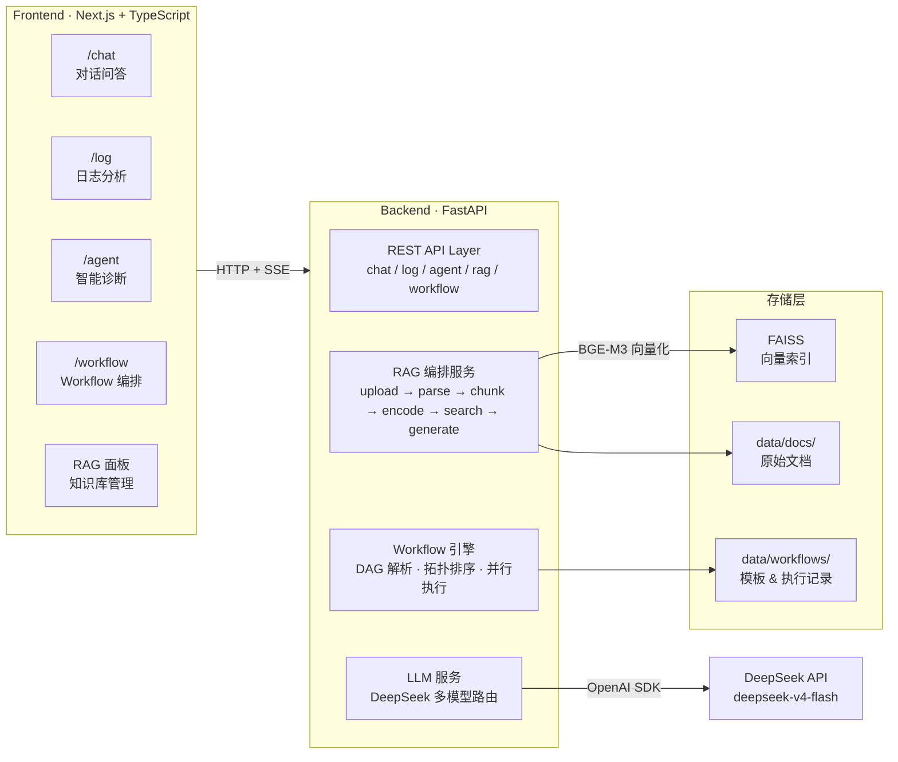

# AI Ops Copilot

智能运维助手 —— 一站式 AIOps 平台：对话问答、日志分析、故障诊断、知识库检索、Workflow 编排。

## 架构总览



## 模块说明

| 模块 | 前端页面 | 后端 API | 说明 |
|------|---------|----------|------|
| **对话Chat** | `/chat` | `POST /api/chat` | 运维专家 System Prompt（内置于 LLM 服务层），支持多轮对话历史 |
| **日志Log** | `/log` | `POST /api/log` | 提交日志文本，返回结构化诊断 JSON |
| **Agent** | `/agent` | `POST /api/agent` | 深层故障诊断，可接收日志分析结果作为上下文 |
| **RAG** | 浮动面板 | `/api/rag/*` | 文档上传 → 自动分块 → BGE-M3 向量化 → FAISS 检索 → LLM 增强回答 |
| **Workflow** | `/workflow`（规划中） | `/api/workflow/*` | DAG 工作流编排，串联多步骤 AI 操作，支持并行执行与 SSE 实时进度 |

### 运维角色

内置三个系统提示词，驱动不同场景的 LLM 行为：

| 角色 | System Prompt | 输出 |
|------|--------------|------|
| `chat_service` | 运维工程师通用回答 | 自由文本 |
| `log_service` | 日志分析专用 | 强制 JSON：`type` / `reason` / `severity` / `solution` |
| `agent_service` | 故障诊断 Agent | 结构化格式：【故障分析】【可能原因】【排查步骤】【解决建议】 |

### Workflow 编排

将 M1-M4 + RAG 串联为可复用的自动化管道。核心设计：

- **DAG 模型**：每一步声明 `depends_on`，引擎自动拓扑排序确定执行层级
- **同层并行**：无相互依赖的步骤通过 `asyncio.gather` 并发执行
- **变量引用**：`$input.xxx` / `$step_id.output.xxx` 语法实现步骤间数据流转
- **内置模板**：故障诊断、批量日志分析、知识增强问答三个开箱即用流程

## API 列表

### 对话 & 分析

| 方法 | 路径 | 说明 |
|------|------|------|
| `POST` | `/api/chat` | 通用运维问答（支持多轮对话 `messages`） |
| `POST` | `/api/log` | 日志分析，返回结构化 JSON |
| `POST` | `/api/agent` | 智能故障诊断（可选传入 `log_analysis`） |

### RAG 知识库

| 方法 | 路径 | 说明 |
|------|------|------|
| `POST` | `/api/rag/upload` | 上传文档（PDF / DOCX / TXT / MD），自动解析入库 |
| `POST` | `/api/rag/query` | RAG 问答，支持 `chat` / `log` / `agent` 三种模式热插拔 |
| `GET` | `/api/rag/documents` | 列出已入库文档 |
| `DELETE` | `/api/rag/documents/{filename}` | 删除文档及其向量 |

### Workflow 编排

| 方法 | 路径 | 说明 |
|------|------|------|
| `POST` | `/api/workflow/templates` | 创建模板 |
| `GET` | `/api/workflow/templates` | 列出所有模板 |
| `GET` | `/api/workflow/templates/{id}` | 模板详情（含完整步骤 DAG） |
| `PUT` | `/api/workflow/templates/{id}` | 更新模板 |
| `DELETE` | `/api/workflow/templates/{id}` | 删除模板 |
| `POST` | `/api/workflow/execute` | 异步执行 Workflow |
| `POST` | `/api/workflow/execute-sync` | 同步执行（等待完成，直接返回结果） |
| `GET` | `/api/workflow/executions` | 执行历史 |
| `GET` | `/api/workflow/executions/{id}` | 执行详情（含每步输入输出） |
| `GET` | `/api/workflow/executions/{id}/stream` | SSE 实时执行进度 |
| `POST` | `/api/workflow/templates/presets/reset` | 重置预置模板 |

### 系统

| 方法 | 路径 | 说明 |
|------|------|------|
| `GET` | `/` | 健康检查 |

## RAG 流程

```
用户上传文档
    │
    ▼
┌──────────────┐
│ 1. 文件解析   │  pdfplumber / python-docx / 纯文本
│    提取文本   │  支持 PDF · DOCX · TXT · MD
└──────┬───────┘
       │
       ▼
┌──────────────┐
│ 2. 智能分块   │  chunk_size=500, overlap=100
│    切片      │  断点优先: 段落 → 换行 → 句号 → 分号
└──────┬───────┘
       │
       ▼
┌──────────────┐
│ 3. 向量化    │  BGE-M3 (BAAI/bge-m3)
│    Embedding │  输出 1024 维 · L2 归一化
└──────┬───────┘
       │
       ▼
┌──────────────┐
│ 4. 存储      │  FAISS IndexIDMap(IndexFlatIP)
│    FAISS     │  余弦相似度 = 内积 (向量已归一化)
└──────┬───────┘
       │
       ▼
┌──────────────┐
│ 5. 检索生成   │  问题向量化 → top-k 搜索 → RAG 模板增强 → LLM 生成
│    RAG       │  支持 chat / log / agent 三种模式热插拔
└──────────────┘
```

## 项目结构

```
AIOps_Assistant/
├── backend/                          # Python FastAPI 后端
│   ├── app/
│   │   ├── main.py                   # 入口：路由注册 + CORS + 启动预加载
│   │   ├── core/config.py            # pydantic-settings 配置管理
│   │   ├── api/                      # 路由层（5 个模块）
│   │   │   ├── chat.py               # POST /api/chat
│   │   │   ├── log.py                # POST /api/log
│   │   │   ├── agent.py              # POST /api/agent
│   │   │   ├── rag.py                # RAG CRUD: upload/query/documents/delete
│   │   │   └── workflow.py           # 模板 CRUD + 执行 + SSE
│   │   ├── schemas/                  # Pydantic 数据模型
│   │   │   ├── chat.py / log.py / agent.py / rag.py / workflow.py
│   │   └── services/                 # 业务逻辑层
│   │       ├── llm_service.py        # LLM 调用封装（OpenAI SDK → DeepSeek）
│   │       ├── rag_service.py        # RAG 编排：上传→分块→编码→存储→检索→生成
│   │       ├── embedding_service.py  # BGE-M3 向量化（SiliconFlow API）
│   │       ├── document_service.py   # 文件解析 + 智能分块
│   │       ├── vector_store.py       # FAISS 向量存储封装
│   │       ├── workflow_engine.py    # DAG 执行引擎（拓扑排序 + 并行执行）
│   │       └── workflow_store.py     # JSON 文件持久化 + 3 个预置模板
│   ├── services/
│   │   └── prompt_service.py         # 所有 System Prompt 模板
│   ├── requirements.txt              # Python 依赖
│   ├── Dockerfile                     # Python 3.12-slim 镜像
│   └── .env                           # 密钥配置（DeepSeek + SiliconFlow）
├── frontend/                          # Next.js 16 + TypeScript
│   ├── src/
│   │   ├── app/
│   │   │   ├── layout.tsx            # 根布局（AppWrapper 包裹）
│   │   │   ├── AppWrapper.tsx        # RAGProvider + 浮动按钮
│   │   │   ├── page.tsx              # 首页导航（3 个功能入口）
│   │   │   ├── chat/page.tsx         # 对话页面（多轮对话 + Markdown 渲染）
│   │   │   ├── log/page.tsx          # 日志分析页面
│   │   │   ├── agent/page.tsx        # Agent 智能诊断页面
│   │   │   └── globals.css           # Tailwind 基础样式
│   │   ├── components/
│   │   │   ├── RAGProvider.tsx       # RAG React Context（全局状态管理）
│   │   │   ├── RAGFloatingButton.tsx # 右下角浮动知识库按钮
│   │   │   └── RAGDrawer.tsx         # 右侧滑出抽屉（开关/上传/删除/检索设置）
│   │   └── lib/api.ts               # 后端 API 客户端封装（7 个接口）
│   ├── package.json                  # Next.js 16.2.6, React 19.2.4
│   ├── tailwind.config.js
│   └── Dockerfile                     # Node 22-alpine 多阶段构建
├── data/
│   ├── docs/测试文本1.md              # 测试知识库（K8s/Redis/Nginx/Linux 运维）
│   ├── faiss/                         # FAISS 索引 + metadata.json
│   └── workflows/
│       ├── templates/                 # 3 个预置模板 JSON
│       └── executions/                # 执行记录 JSON
├── docker-compose.yml                 # 一键编排（backend + frontend + 命名卷）
└── README.md                          # 完整项目文档

```

## 本地启动

### 环境要求

- Python 3.10+
- Node.js 18+
- （可选）GPU 以加速 BGE-M3 推理

### 1. 后端

```bash
cd backend

# 创建虚拟环境
python -m venv venv
source venv/bin/activate   # Windows: venv\Scripts\activate

# 安装依赖
pip install -r requirements.txt

# 配置环境变量
cp .env.example .env
# 编辑 .env 填入你的 DeepSeek API Key

# 启动 (端口 8000)
uvicorn app.main:app --reload
```

### 2. 前端

```bash
cd frontend

npm install
npm run dev     # 启动在 http://localhost:3000
```

### 3. 验证

```bash
# 健康检查
curl http://localhost:8000/

# 查看预置 Workflow 模板
curl http://localhost:8000/api/workflow/templates

# 上传知识库文档
curl -X POST http://localhost:8000/api/rag/upload \
  -F "file=@your_ops_manual.pdf"

# 执行 Workflow
curl -X POST http://localhost:8000/api/workflow/execute-sync \
  -H "Content-Type: application/json" \
  -d '{
    "template_id": "incident_diagnosis",
    "input": {
      "logs": "[ERROR] CPU usage 100% on node-3",
      "error_description": "node-3 服务响应超时"
    }
  }'
```

## Docker 启动

```bash
# 后端
cd backend
docker build -t aiops-backend .
docker run -p 8000:8000 --env-file .env aiops-backend

# 前端
cd frontend
docker build -t aiops-frontend .
docker run -p 3000:3000 aiops-frontend
```

## 技术选型

| 选择 | 理由 |
|------|------|
| **FastAPI** | 原生 async、自动 OpenAPI 文档、类型安全，适合 AI 服务后端 |
| **DeepSeek** | OpenAI 兼容 API，中文问答能力优秀，性价比高 |
| **OpenAI SDK** | 标准协议，后续切换模型供应商无需改代码 |
| **FAISS** | 轻量、零运维、进程内运行。无需部署 Milvus / Qdrant 等独立向量数据库，适合单机 Demo |
| **BGE-M3** | 中文语义理解优秀，1024 维在精度与速度间平衡良好，`sentence-transformers` 一行加载 |
| **sentence-transformers** | BGE-M3 原生支持，封装了 tokenizer + pooling + normalize |
| **pdfplumber + python-docx** | 纯 Python，无系统依赖，比 PyMuPDF 更轻量 |
| **SSE (sse-starlette)** | Workflow 实时进度推送，比 WebSocket 更简单，单向数据流，HTTP 天然兼容 |
| **JSON 文件存储** | Workflow 模板和执行记录用 JSON 文件持久化，零依赖，适合单机；生产可升级为 SQLite / PostgreSQL |
| **自建 DAG 引擎** | 步骤类型仅 4 种，300 行代码即可完成拓扑排序 + 并行执行 + 变量解析，无需引入 Temporal / Airflow 等重型框架 |

## 预置 Workflow 模板

### 1. 故障诊断流程 `incident_diagnosis`

```
输入: { logs, error_description }

日志分析 ──→ Agent 诊断 ──→ RAG 检索 ──→ 综合报告
```

4 步串联：提交日志即可获得完整的运维故障诊断报告。

### 2. 批量日志分析 `batch_log_analysis`

```
输入: { logs }

日志分析 (M3) ──→ 汇总报告 (M1)
```

适合一次性分析大量日志文本。

### 3. 知识增强问答 `rag_enhanced_qa`

```
输入: { question }

RAG 检索 ──→ 增强回答
```

先检索知识库文档，再用检索结果增强 LLM 回答质量。
